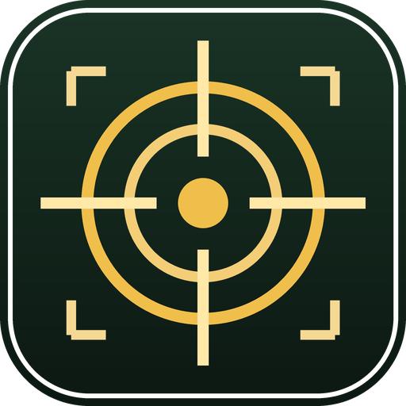
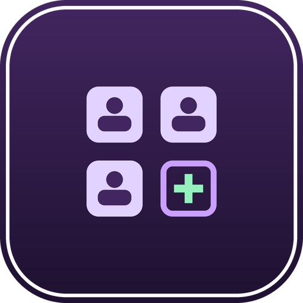

# T3chnicalD3ath Plugin Repository

A third-party plugin repository for **[Dalamud](https://github.com/goatcorp/Dalamud)** (FINAL FANTASY XIV / XIVLauncher).

<p align="center">
  
  
  
</p>

---

## Installation

Copy this URL:

```
https://raw.githubusercontent.com/t3knical/DalamudPlugins/main/repo.json
```

Then, in game:

1. Type `/xlsettings` to open the Dalamud settings
2. Go to the **Experimental** tab
3. Paste the URL into an empty row under **Custom Plugin Repositories**
4. Press **+**, then **Save and Close**
5. Open `/xlplugins` and install from the list

---

## At a glance

| | Plugin | What it does | Command |
|:--:|---|---|---|
|  | **Hunter** | Farms mob-drop items automatically, end to end | `/hunter` |
|  | **Party Monitor** | Watches party changes, relays them to Discord | `/pm` |
|  | **Party Recruitment Helper** | Saves and re-applies Party Finder slot layouts | `/pfhelper` |
|  | **PingWatcher** | Latency display that works on Linux/Wine | `/ping` |

---

##  Hunter

Point it at the items you need and it does the rest — teleports to the right zone,
mounts up, flies to spawn points, fights, chains kills, tracks your inventory, and
heads home when everything is done.

**Hunt lists.** Items live in named lists you can toggle on and off, like
GatherBuddyReborn's auto-gather lists. Build one per project ("Cooking mats", "GC
turn-ins") and switch between them instead of retyping entries. List order is priority
order, and lists reorder by drag and drop.

**Import from Artisan.** Pull a crafting list's full ingredient totals straight from
[Artisan](https://github.com/PunishXIV/Artisan). Only ingredients that actually drop
from mobs in the database are added — gatherables and vendor items are skipped and
reported, since those belong to GatherBuddy or a vendor run.

**Editable mob database.** Add or edit mobs entirely in game: base ID, zone, loot table
and spawn coordinates. The *Add current position* button captures wherever you're
standing, so building a patrol route is stand → click → repeat. Stored as `mobs.json`
in the plugin config folder, so it survives updates.

**Smart travel.** Movement is a port of GatherBuddyReborn's system — vnavmesh over IPC,
real mount actions rather than simulated keypresses, and flight decided by your actual
aether-current completion per zone. Because mobs *move*, the bot snapshots a target's
position when it commits to flying, flies to that fixed point without re-pathing
mid-air, lands, and only then chases on the ground.

**Live overlay.** A compact always-on-top window showing state, per-item progress with
item icons, and the current target. Click the header to start/stop, right-click to open
the main window, click any item to toggle it.

> **Requires** [vnavmesh](https://github.com/awgil/ffxiv_navmesh) (pathfinding),
> Rotation Solver Reborn (combat) and
> [Lifestream](https://github.com/NightmareXIV/Lifestream) (teleports).
> [Artisan](https://github.com/PunishXIV/Artisan) is optional, for ingredient import.

---

##  Party Monitor

Keeps an eye on your party and tells you when it changes — members joining, members
leaving — so you notice a quiet departure without staring at the party list.

**Discord relay.** Optionally forward party activity to Discord, either through a simple
**webhook** or a full **bot token** if you want richer behaviour.

**Remote commands.** With a bot configured, you can enable remote commands and drive
simple actions (such as `/leave`) from Discord instead of alt-tabbing back into the
game.

**FFLogs lookups.** Supply your own FFLogs client ID and secret to pull encounter data
for party members.

**Tunable.** Set the zone it watches and how often it refreshes.

#### Why it ships with a helper process (TempScraper)

Party Monitor pulls raid progression from **[Tomestone.gg](https://tomestone.gg)**, which
renders its character pages with JavaScript. A plain HTTP request returns an empty
shell, so the data has to be read from a real browser engine. That work is done by
**TempScraper**, a small console program bundled at `TempScraper/` inside the plugin.

It runs as a **separate process** rather than inside the plugin for three reasons:

- **The game thread stays responsive.** Browser automation is slow and blocking;
  running it in-process would stutter FFXIV every time a party member was looked up.
- **A hung or crashed scrape can't take the game with it.** The worst case is a dead
  child process, which the plugin simply restarts.
- **Selenium's dependencies don't belong in the game.** Loading a browser-automation
  stack into the FFXIV process is a much larger surface than launching a sandboxed
  child.

It is started **once** and kept alive, then fed lookups over stdin — so checking a full
party is a series of requests against one warm browser session rather than a cold start
per person. Nothing runs until you actually use the feature.

> **Privacy and credentials:** Discord and FFLogs integration are entirely optional and
> require *your own* credentials, entered in the plugin's settings. They are stored in
> your local Dalamud config and passed to TempScraper through environment variables —
> never compiled into the binaries, never written to the command line, and never
> included in this repository. Diagnostic logging is off unless you set
> `PARTYMONITOR_DEBUG`, and writes to your temp folder when enabled.

---

##  Party Recruitment Helper

Recruiting in Party Finder means rebuilding the same slot layout every time somebody
joins and leaves. This saves that layout and puts it back for you.

**Slot presets.** Save a Party Finder slot configuration once and reapply it whenever
you need it.

**Auto-reapply.** Turn on `AutoReapply` and the layout is restored automatically when a
member leaves, so your listing keeps recruiting the roles you actually want instead of
reverting to open slots.

**Timing control.** `RoleSelectDelayMs` tunes how quickly it drives the role dropdowns —
raise it if the game's UI can't keep up on your machine.

---

##  PingWatcher

Shows your connection latency in the server info bar, with an optional live graph and
monitor window.

| Command | Does |
|---|---|
| `/ping` | Toggle the ping display |
| `/pinggraph` | Toggle the latency graph |
| `/pingconfig` | Open settings |

**Why this fork exists:** it adds game-server address detection that works under
**Linux / Wine**, where the standard client-state method fails to resolve an address and
the ping display stays empty.

> An unofficial fork of [PingPlugin](https://github.com/karashiiro/PingPlugin) by
> **[karashiiro](https://github.com/karashiiro)**, redistributed under the MIT License.
> All original credit goes to them.
>
> **Playing on Windows? Install the official PingPlugin instead** — it is maintained by
> its author and stays more current than this fork.

---

## Attribution

**PingWatcher** is a fork of another developer's work. Original credit belongs to
karashiiro, and their MIT licence ships alongside it in
[`licenses/PingWatcher-LICENSE`](licenses/PingWatcher-LICENSE).

See **[CREDITS.md](CREDITS.md)** for full acknowledgements, including the projects that
inspired Hunter. If you authored something here and would like it removed, open an
issue and it will be taken down.

---

## Support

Found a bug or have a request? [Open an issue](https://github.com/t3knical/DalamudPlugins/issues).

For **PingWatcher**, please check whether the problem also happens with the upstream
plugin before reporting it here.

---

<sub>Not affiliated with SQUARE ENIX. FINAL FANTASY is a registered trademark of Square Enix Holdings Co., Ltd.</sub>
