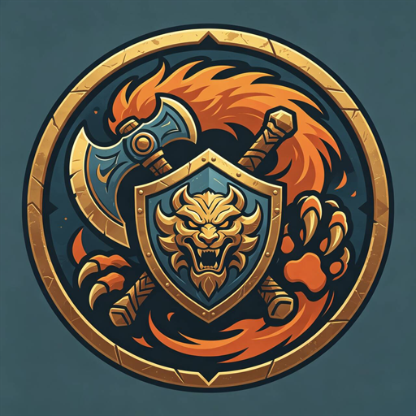
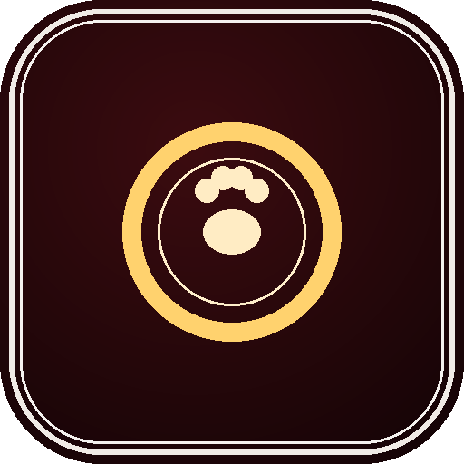
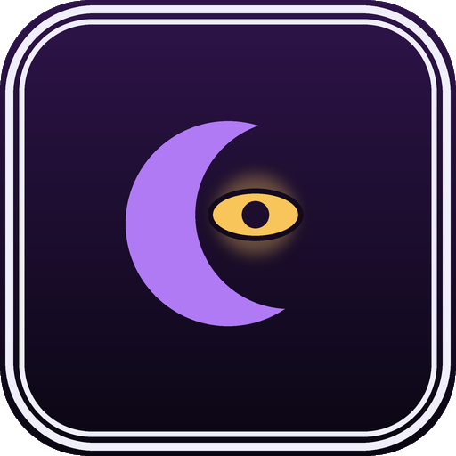
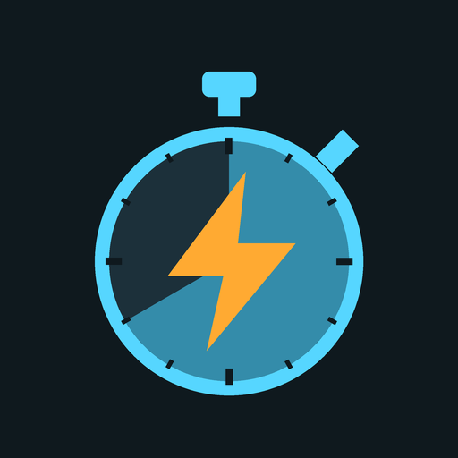

# T3chnicalD3ath Plugin Repository

A third-party plugin repository for **[Dalamud](https://github.com/goatcorp/Dalamud)** (FINAL FANTASY XIV / XIVLauncher).

<p align="center">
  
  
  
</p>

---

## Installation

Copy this URL:

```
https://raw.githubusercontent.com/t3knical/DalamudPlugins/main/repo.json
```

Then, in game:

1. Type `/xlsettings` to open the Dalamud settings
2. Go to the **Experimental** tab
3. Paste the URL into an empty row under **Custom Plugin Repositories**
4. Press **+**, then **Save and Close**
5. Open `/xlplugins` and install from the list

---

## At a glance

| | Plugin | What it does | Command |
|:--:|---|---|---|
|  | **Beast Master Helper** | Beastmaster quests, catalogue, DPS rotation and Crucible of the Unbroken automation | `/bmh` |
|  | **BossmodReborn (Tekz Fork) [Would Recommend Only For Suggested Team Mode]** | Unofficial fork of BossMod Reborn, with Crucible of the Unbroken and Occult Crescent module work | `/bmr` |
|  | **Hunter** | Farms mob-drop items automatically, end to end | `/htr` |
|  | **Occult Helper** | Automates Occult Crescent — treasure hunts, FATEs/CEs, Illegal Mode | `/och` |
|  | **Party Monitor** | Watches party changes, relays them to Discord | `/pm` |
|  | **Party Recruitment Helper** | Saves and re-applies Party Finder slot layouts | `/prh` |
|  | **PingWatcher** | Latency display that works on Linux/Wine | `/pwr` |
|  | **Reaction Helper** | Fight timelines and per-job reactions that drive your rotation plugins - toggles, skills, targeting, summons | `/rhr` |

---

##  Beast Master Helper

Everything Beastmaster in one plugin: the quest chain and beast catalogue, a DPS rotation
that plays the job's kit, and full **Crucible of the Unbroken** automation - from queueing
and picking a team to fighting each piece, looting, spending tokens and shopping.

> **An English fork of [Beastmaster](https://github.com/anmili2022/Beastmaster) by
> [Anmi](https://github.com/anmili2022).** The catalogue, quest tracking, capture and gauge
> work are theirs - this fork translates it, makes it run on the Global client, and adds
> the rotation and Crucible automation on top.

New here? The plugin ships a `walkthrough.md` that takes you from a fresh install to a running
Crucible setup, including the BossMod side.

### Tracking

- **Catalogue.** All 50 beasts with attribute, location, level range and coordinates. Navigate
  to a spawn, or open the Duty Finder for the ones that live in dungeons.
- **Quest chain.** Progress read from your client's own quest state, with navigation to the giver
  of anything unfinished.
- **Auto-capture.** Optional, and only ever acts on a target you selected yourself.
- **Gauge readout.** Read-only view of Tenacity, Beast Power, Beast Heart and Beast Soul.
- **Reads in your language.** Names are looked up from the client's own data by row id, so it
  displays correctly whatever language you play in.

### Rotation

A priority-list rotation tuned toward maximum damage: the Instinct wheel with the right
axe for the held Heart (including the Universality finisher), Rally and Rallying Cheer sequenced
around banked stacks, Trick, Shield Charge as a gap closer, and cooldown-aware AoE. **Reset to
recommended (max DPS)** puts every rotation setting back to the tuned values.

- **Familiars.** Summons, Borrow and Tempered Release are handled per familiar; the cycle
  dismisses each with Parting Blow so the next can come out.
- **Kinship actions** (Beast Mode) each get their own rule: Quelling Wave at range only, Soul Crush
  on interruptible casts, mitigation skins ahead of the matching damage, Scouring Ash on a cleansable
  debuff. A Borrow lasts 60s, and the planner refreshes it before the next familiar swap.
- **Snarl / Challenge.** Keep Covered for normal play; Suggested Team Mode runs its own smart
  version (see below) and ignores that toggle.

### Crucible of the Unbroken

Runs the whole loop: enter, pick a team, prepare, fight, collect the Territory Tokens, spend them,
and move to the next piece. It reads the Icy Veins guide as data.

- **Suggested Team Mode.** The guide's team and strategy for every fight on all five boards.
  Each fight has a plan: which familiar is Borrowed (Scouring Ash, Soul Crush, Quelling Wave or a
  mitigation skin) and which are Tempered Released for damage; a named opener (Ghost first for
  Flauros Piece, Ice Golem for Soul Crush, Karlabos or Gigantoad for Quelling Wave) that lands its
  Borrow before the tank comes out; and a prompt handoff with Parting Blow.
- **Smart Snarl / Challenge.** Damage is shared between you and the familiars rather than
  ground out on one: a familiar covers while healthy, hands back at its share floor, covers you when
  you are hurt or in an emergency, and you take tank busters yourself with the mitigation lent. A
  utility familiar never covers you unless you are in real trouble. All thresholds are sliders.
- **Fight-specific mechanics.** Drake Piece runs its Barbmole sequence (dispel Blaze Spikes with
  Quelling Wave, wait for the moles to gather, Meteor, then Parting Blow) and its Morpho feed: the
  familiar is put on Steady, Quelling Wave lowers each Morpho from range to under half health, and no
  familiar is summoned until Abaddon has eaten them all.
- **Board options.** Per-fight team and use overrides, with **Reset to dev-planned defaults**.
- **Loot, tokens and shop.** Territory Tokens are collected reliably and spent on a planned shopping
  list (the Beast Potion Kit is a high priority); items are used only in a live fight.
- **Overlays.** Toggleable in the settings: the main overlay, the familiar overlay and a debug panel
  showing what BossMod sees.

### BossMod integration

BMH talks to the Tekz fork of BossMod Reborn over IPC. **On a Crucible board it creates a
`BeastMasterCrucible` movement preset, sets it as BossMod's AI preset and switches AI on when a module
loads, then switches AI off again a few seconds after the module ends.** It only acts inside the Crucible
territories and never turns off an AI you switched on yourself. Toggle: **Config -> Crucible ->
Auto-configure BossMod movement** (on by default). Needs BossmodReborn (Tekz Fork) **1.0.64** or newer.

### Reaction Helper - worth grabbing for the Crucible

**[Reaction Helper](#reaction-helper)** (`/rhr`, in this repo) runs Crucible fights from timelines and profiles: it places the
opener summon and Borrow, holds or overrides BMH's toggles at the right moment, picks targets in BossMod's order, gap-closes to
adds, and does the Drake's Morpho feed, the Flauros Ghost opener and the Gigantis Soul Crush interrupt - falling back to other
familiars of the same kind when your team is not the guide's. **For the Crucible fights it covers, BMH plays them properly only
with it.** Install it, then tick **Let Reaction Helper run this fight** in BMH's board options for a fight so BMH stops planning
it itself. Needs Beast Master Helper 0.9.78 or newer.

> **Requires** BossmodReborn (Tekz Fork) for the Crucible automation.
> [vnavmesh](https://github.com/awgil/ffxiv_navmesh) and
> [Lifestream](https://github.com/NightmareXIV/Lifestream) are optional, for walking and cross-zone
> travel; without them it still tracks everything, it just cannot walk you there.

---

##  BossmodReborn (Tekz Fork) [Would Recommend Only For Suggested Team Mode]

An unofficial fork of **BossMod Reborn** with extra work on top: AI-steered modules for the
**Beastmaster / Crucible of the Unbroken** boards (First, Second and Third Board, including the Masters
boards), tuned against recorded replays rather than reasoned from the game's own data alone, plus a set
of **Occult Crescent** Critical Engagement and FATE modules kept independently of upstream's own
versions. Renamed (`BossModRebornTekz`, distinct install and config folders) so it can never be confused
with, or collide with, the real BossModReborn - install the original from
[FFXIV-CombatReborn/BossmodReborn](https://github.com/FFXIV-CombatReborn/BossmodReborn) if that's what
you're after.

**Why it matters for Beastmaster.** The Crucible pieces are scripted around your familiars, so the
modules publish what Beast Master Helper needs over IPC: what to interrupt, dispel or cleanse, which
enemies are forbidden to attack right now, when a tank buster or raidwide is coming, and a few
fight-specific stages. For example, Drake Piece leaves the Barbmoles alone until Meteor has landed and
holds the Drake's Blaze Spikes for a Quelling Wave dispel, and a Morpho counts as ready to feed to
Abaddon at 50% health.

**IPC for other plugins.** Besides presets and hints, it exposes AI status and control -
`BossMod.AI.IsEnabled`, `AI.Enable(slot)` and `AI.Disable` - so a plugin can switch AI on for its own
content without clobbering a state you set up by hand, and `Hints.DispelTargetID`, the enemy a module
wants dispelled even when it is otherwise forbidden to attack.

### Recommended AI setup

BMR's **AI config** section:

- **Forbid actions**: off
- **Forbid movement**: off
- **Idle while mounted**: off
- **Follow target**: off
- **Follow during combat**: off
- **Follow during active boss module**: off
- **Manual targeting**: off
- **Disable loading obstacle maps**: off
- **Max distance to target**: `2.6`
- **to slots**: `1`
- **Min distance**: `-10`
- **Preferred distance to forbidden zones**: `0.05`
- **Movement delay**: `0.05`

**The preset sets itself up.** Beast Master Helper creates the `BeastMasterCrucible` preset, makes it the AI preset and turns AI on for a Crucible fight and off again afterwards, so you don't need to build a preset by hand. The values above are for the AI config screen only.

> An unofficial fork of [BossMod Reborn](https://github.com/FFXIV-CombatReborn/BossmodReborn) by
> **The Combat Reborn Team**, itself building on veyn's original BossMod. Redistributed under
> BSD-3-Clause with the original notice intact; bugs in the fork's own module work are this fork's,
> not the Combat Reborn Team's — report them at
> [t3knical/DalamudPlugins](https://github.com/t3knical/DalamudPlugins).

---

##  Hunter

Point it at the items you need and it does the rest — teleports to the right zone,
mounts up, flies to spawn points, fights, chains kills, tracks your inventory, and
heads home when everything is done.

**Hunt lists.** Items live in named lists you can toggle on and off, like
GatherBuddyReborn's auto-gather lists. Build one per project ("Cooking mats", "GC
turn-ins") and switch between them instead of retyping entries. List order is priority
order, and lists reorder by drag and drop. When an item drops from more than one mob, the
**Found in** column turns into a picker so you can pin it to the mob — and therefore the
zone — you'd rather farm it from.

**Import from Artisan.** Pull a crafting list's full ingredient totals straight from
[Artisan](https://github.com/PunishXIV/Artisan). Only ingredients that actually drop
from mobs in the database are added — gatherables and vendor items are skipped and
reported, since those belong to GatherBuddy or a vendor run.

**Editable mob database.** Add or edit mobs entirely in game: base ID, zone, loot table
and spawn coordinates. The *Add current position* button captures wherever you're
standing, so building a patrol route is stand → click → repeat. Stored as `mobs.json`
in the plugin config folder, so it survives updates.

**Loot learning — the database grows itself.** Turn on *Learn drops from kills* in the
**Loot Learner** tab and Hunter watches what you actually loot. It snapshots your bags
when a fight starts, snapshots them again a couple of seconds after the mob dies, and
credits anything that went **up in quantity** to that mob — so an item you already own a
stack of still registers.

- **Known mob, new item** → the item is appended to that mob's loot table.
- **Unknown mob** → the entry is created for you, seeded with its base ID, zone and the
  spot it died at.

It works from **manual kills**; auto-hunt does not have to be running, which is the point
— the bot can only route to mobs it already knows, so discovery has to happen while
*you* are the one fighting. Only your own bags are watched, so retainer and saddlebag
movement can't be mistaken for a drop.

Everything it learns is listed in the session log on that tab, with an **Undo** button per
row. That matters, because anything you pick up in the seconds after a kill gets credited
to it — a gathering node, a desynth, or a party member's trade landing in that window can
teach it something wrong. Live diagnostics (baseline held, current watch target, awaiting
loot) are on the **Debug** tab.

**Stays out of other players' way.** If someone is already fighting at the spawn Hunter is
heading for, it backs off, marks that spawn as taken for a few minutes, and goes and works
a different item on your list instead of competing for their kills. It comes back later. A
fight already in progress is never abandoned, and party members don't count as competition.
Radius and cooldown are tunable in *Config → Sharing the World*.

**Smart travel.** Movement is a port of GatherBuddyReborn's system — vnavmesh over IPC,
real mount actions rather than simulated keypresses, and flight decided by your actual
aether-current completion per zone. Because mobs *move*, the bot snapshots a target's
position when it commits to flying, flies to that fixed point without re-pathing
mid-air, lands, and only then chases on the ground.

**Live overlay.** A compact always-on-top window showing state, per-item progress with
item icons, and the current target. Click the header to start/stop, right-click to open
the main window, click any item to toggle it. It hides itself while no list or item is
enabled and reappears the moment you enable one, so it isn't sitting on your screen doing
nothing (switchable in *Config → Overlay*).

> **Requires** [vnavmesh](https://github.com/awgil/ffxiv_navmesh) (pathfinding),
> Rotation Solver Reborn (combat) and
> [Lifestream](https://github.com/NightmareXIV/Lifestream) (teleports).
> [Artisan](https://github.com/PunishXIV/Artisan) is optional, for ingredient import.

---

##  Occult Helper

Automates the grind in **Occult Crescent** (Cosmic Exploration): routes treasure, pot, and carrot
hunts end to end, tracks FATEs and Critical Encounters with a panel that tells you what they reward
and pathfinds you there, and includes an "Illegal Mode" autopilot for when you'd rather not touch any
of it yourself.

**Hunt routing.** Treasure, pot-chest, and carrot hunts all get real route optimization rather than
"walk to the nearest thing" — 2-opt/Or-opt passes, 3D distance, and resumable progress if you get
interrupted mid-run.

**FATE/CE panel.** Shows what's active, what it rewards, and can path you straight to it.

**Illegal Mode.** A more hands-off autopilot layered on top of the CE/FATE core — parking, targeting,
reachability gating, and countdown tracking.

**Status overlay.** A small always-on-top popout with live per-mode sections (world state, AI status,
chest/carrot hunt progress) so you don't need the main window open.

**Currency & experience trackers**, gearset/Phantom Job presets per activity, and a config UI with
tabbed sections.

> An unofficial fork of [OccultHelper](https://github.com/OhKannaDuh/OccultHelper) by
> **[OhKannaDuh](https://github.com/OhKannaDuh)**, redistributed under the GNU AGPLv3. All credit for
> the original project goes to them; this fork carries ongoing maintenance and new features on top.

---

##  Party Monitor

Keeps an eye on your party and tells you when it changes — members joining, members
leaving — so you notice a quiet departure without staring at the party list.

**Discord relay.** Optionally forward party activity to Discord, either through a simple
**webhook** or a full **bot token** if you want richer behaviour.

**Remote commands.** With a bot configured, you can enable remote commands and drive
simple actions (such as `/leave`) from Discord instead of alt-tabbing back into the
game.

**FFLogs lookups.** Supply your own FFLogs client ID and secret to pull encounter data
for party members.

**Tunable.** Set the zone it watches and how often it refreshes.

#### Why it ships with a helper process (TempScraper)

Party Monitor pulls raid progression from **[Tomestone.gg](https://tomestone.gg)**, which
renders its character pages with JavaScript. A plain HTTP request returns an empty
shell, so the data has to be read from a real browser engine. That work is done by
**TempScraper**, a small console program bundled at `TempScraper/` inside the plugin.

It runs as a **separate process** rather than inside the plugin for three reasons:

- **The game thread stays responsive.** Browser automation is slow and blocking;
  running it in-process would stutter FFXIV every time a party member was looked up.
- **A hung or crashed scrape can't take the game with it.** The worst case is a dead
  child process, which the plugin simply restarts.
- **Selenium's dependencies don't belong in the game.** Loading a browser-automation
  stack into the FFXIV process is a much larger surface than launching a sandboxed
  child.

It is fed lookups over stdin and keeps its browser warm between them, so checking a full
party is a series of requests against one session rather than a cold start per person.
The browser is treated as **disposable**: nothing launches until you actually use the
feature, it is recycled every so many lookups, and it shuts down completely once idle,
restarting on demand. A long-lived headless Chrome on a JavaScript-heavy page will
otherwise grow without bound — it was reaching multiple gigabytes before this.

> **Privacy and credentials:** Discord and FFLogs integration are entirely optional and
> require *your own* credentials, entered in the plugin's settings. They are stored in
> your local Dalamud config and passed to TempScraper through environment variables —
> never compiled into the binaries, never written to the command line, and never
> included in this repository. Diagnostic logging is off unless you set
> `PARTYMONITOR_DEBUG`, and writes to your temp folder when enabled.

---

##  Party Recruitment Helper

Recruiting in Party Finder means rebuilding the same slot layout every time somebody
joins and leaves. This saves that layout and puts it back for you.

**Status at a glance.** The first tab tells you in plain words what is going to happen —
whether the recruitment window is open, how many slots are filled, which preset is active,
and what the last auto-reapply actually did. One button applies the active preset.

**Presets.** A searchable list on the left, the editor on the right. Right-click any
preset to set it active, apply it, rename, duplicate or delete it. A preset stores the
whole listing: duty and category, objective, description, minimum item level, completion
status, one-player-per-job, and which jobs each of the eight slots accepts — captured
straight from the game's own Recruitment Criteria window.

**Auto-reapply.** When a member leaves, the game reverts your listing to open slots. This
puts the layout straight back, so you keep recruiting the roles you actually want. By
default it restores just the slots and leaves your criteria alone — there's an option to
re-apply the whole preset instead.

**Timing control.** It drives the game's real dropdowns, so it has to pace itself. Raise
the role-select delay if slots come out half-applied on your machine.

> Everything happens through the game's own Party Finder window — no network calls, and
> presets stay in the plugin's config folder.

---

##  PingWatcher

Shows your connection latency in the server info bar, with an optional live graph and
monitor window.

| Command | Does |
|---|---|
| `/ping` (`/pwr`) | Toggle the ping display |
| `/pinggraph` | Toggle the latency graph |
| `/pingconfig` | Open settings |

**Why this fork exists:** it adds game-server address detection that works under
**Linux / Wine**, where the standard client-state method fails to resolve an address and
the ping display stays empty.

> An unofficial fork of [PingPlugin](https://github.com/karashiiro/PingPlugin) by
> **[karashiiro](https://github.com/karashiiro)**, redistributed under the MIT License.
> All original credit goes to them.
>
> **Playing on Windows? Install the official PingPlugin instead** — it is maintained by
> its author and stays more current than this fork.

---

##  Reaction Helper

A TensorReactions-style reaction engine: load a **fight timeline**, hang **reactions** on its mechanics, and let
it press skills, flip your rotation plugin's toggles, pick targets and place summons at the right moment.
Open it with `/rhr`.

**Timelines.** Loads [cactbot](https://github.com/quisquous/cactbot) timelines (the *Get Timelines* button
downloads them), syncs to the fight from the game's own messages, and shows a coming-up list and overlay. Every
pull is **recorded**; pick pulls in the Replays tab and *Build Timeline* to make a clean timeline from what actually
happened - the boss (not the last add), adds as named waves, repeats collapsed, `[------ START ------]` and
`[------ END ------]` markers, and A/B lines where different pulls diverged.

**Reactions.** Each reaction has a window around a mechanic, **conditions** (you, your target, your party, enemies
present, a status, an action's charges, the familiars on your Battlehorns, the kinship lent...) and **actions**:

- press a skill (by name or ID, on your target, on yourself or on a named enemy) with or without the weave window,
- flip, hold or temporarily override a toggle of a loaded rotation plugin, queue a hotbar action, send a pet command,
- target an enemy by priority (name IDs, skip shielded ones, limit by HP), clear the target,
- show an alert, run a command, set a variable.

It works with **Beast Master Helper** (and MachinistHelper, when installed) over IPC (any
plugin that implements the same small contract can be driven), and reads
BossMod Reborn's hints when it is loaded. For Beastmaster it can run a whole
Crucible fight plan - opener summon, Borrow, Meteor, the Drake's Morpho feed, gap closes to adds - as reactions; hand a fight
to it from Beast Master Helper's board options.

**Profiles.** Timeline profiles belong to one fight and load on zone-in; general profiles run for the jobs you tick.
Right-click anything to copy, paste (folders too), rename or delete it, and *Test Now* runs a reaction on the spot.

**Ships with the Crucible.** The recorded timelines for the Crucible fights we have covered (First Board through Second Master's Board) and the Beastmaster profile for each - openers, Borrow, Meteor, targeting, gap closes - are bundled and installed on first launch. A profile or timeline you have edited is never overwritten by an update; delete it to get the shipped copy back.

> Beastmaster features need Beast Master Helper 0.9.78 or newer.

---

## Attribution

**PingWatcher** and **Occult Helper** are forks of other developers' work. Original credit for
PingWatcher belongs to karashiiro (MIT, [`licenses/PingWatcher-LICENSE`](licenses/PingWatcher-LICENSE)),
and for Occult Helper to OhKannaDuh (AGPLv3, [`licenses/OccultHelper-LICENSE`](licenses/OccultHelper-LICENSE)).

See **[CREDITS.md](CREDITS.md)** for full acknowledgements, including the projects that
inspired Hunter. If you authored something here and would like it removed, open an
issue and it will be taken down.

---

## Support

Found a bug or have a request? [Open an issue](https://github.com/t3knical/DalamudPlugins/issues).

For **PingWatcher** or **Occult Helper**, please check whether the problem also happens with the
upstream project before reporting it here.

---

<sub>Not affiliated with SQUARE ENIX. FINAL FANTASY is a registered trademark of Square Enix Holdings Co., Ltd.</sub>